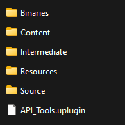

## 🇩🇪 Anleitung zur Verwendung des Plugins RHI API - Tools

Dieses Plugin enthält 9 verschiedene Nodes, die Sie im Screenshot unten sehen können:

   

<h1 align="center">RHI API Tools</h1>

   

Das Plugin wurde ausschließlich für Unreal Engine 5.4 entwickelt und getestet.

Diese Nodes ermöglichen es den Spielern, direkt im Spiel zwischen DirectX 11, DirectX 12 und Vulkan zu wechseln. Das Plugin speichert den ausgewählten Startparameter in einer Textkonfigurationsdatei und kann eine sekundäre ausführbare Datei (`*_Launcher.exe`) verwenden, die als Launcher fungiert — mit demselben Symbol, wie im Plugin-Bereich oder auf der Hauptseite dieses Repositories angegeben.

Wenn Sie das Symbol des Launchers ändern möchten, können Sie Drittanbieter-Tools verwenden.

---

### Integration in Ihr Projekt

Wenn Sie das Plugin erworben haben und es in Ihr Projekt integrieren möchten:

- **Laden Sie `RHI_API_Tools_Launcher.exe` über folgenden Link herunter:**

**[RHI_API_Tools_Launcher.exe](https://github.com/GH-GAMES/RHI_API_Tools/blob/main/Launcher/RHI_API_Tools_Launcher.exe)**

- Im Ordner `Resources` befindet sich eine Vorlage der Startparameter-Datei:

  - `launch_parameter.txt`

> Wichtige Hinweise:  
>  
> - Die Datei `launch_parameter.txt` kann standardmäßig fehlen — das ist **normal**. Sie speichert den Startparameter im Format `-dx11`, `-dx12`, `-vulkan`.  
> - **Der Dateiname muss exakt `launch_parameter.txt` lauten**, mit der Endung `.txt`. Bei Abweichungen kann das Plugin die Datei nicht verwenden — in diesem Fall wird beim nächsten Start eine neue Datei mit dem korrekten Namen erstellt.  
> - Die Datei `RHI_API_Tools_Launcher.exe` kann **beliebig benannt** werden, jedoch wird empfohlen, das Suffix `_Launcher.exe` beizubehalten, um den Launcher leicht vom Hauptprogramm zu unterscheiden.

Sie können den gewünschten Parameter im Voraus festlegen, indem Sie die Datei `launch_parameter.txt` manuell erstellen oder aus dem Ordner `Resources` kopieren.

Wenn Sie das Spiel im **Shipping**-Modus verpackt haben, platzieren Sie beide Dateien im Hauptverzeichnis neben der Haupt-`.exe` — nur so funktioniert das Plugin korrekt.

   

---

### Plugin-Nodes

Alle Nodes befinden sich in der Kategorie **RHI API Tools**

   

---

### API

1. **RHI API Change** — ermöglicht die Auswahl der gewünschten RHI API direkt im Editor oder im verpackten Spiel.

Der String "Selected API" gibt das Ergebnis im Format `"DX11"`, `"DX12"` oder `"VULKAN"` zurück.

Die boolesche Variable `"Force Use Launcher"` erzwingt die Nutzung der Konfigurationsdatei, unabhängig vom Verpackungstyp des Spiels: Debug, Developing oder Publish.

Wichtig: Um die gewählte API für Ihr Spiel/Projekt zu verwenden, müssen Sie es neu starten, da die benötigte API während des Starts initialisiert wird und nicht im Runtime-Modus. Im Runtime-Modus können Sie zwar den gewünschten Parameter ändern, aber er wird erst nach einem vollständigen Neustart übernommen.

P.S. Innerhalb des UE5-Editors sehen Sie immer nur die API, die in den Projekteinstellungen festgelegt ist, da die Vorschau des Spiels/Projekts mit diesem Parameter gestartet wird, da er bereits vor dem eigentlichen Start initialisiert wird.

   

2. **Get Current API** — gibt die aktuell verwendete API zurück (`DX11`, `DX12`, `VULKAN`).

   

3. **Get Supported RHI API** — gibt ein Array von unterstützten APIs zurück (`DX11`, `DX12`, `VULKAN`).

   

---

### VRAM

4. **Get Available VRAM** — gibt den verfügbaren Videospeicher zurück (`Float`).

   

5. **Get Reserved VRAM by Game** — gibt den vom Spiel belegten Videospeicher zurück (`Float`).

   

6. **Get Total VRAM** — gibt die gesamte unterstützte VRAM-Kapazität zurück (`Float`).

   

---

### Startmodus der Anwendung

7. **RHI Get Current Launch Mode** — liefert Informationen darüber, wie das Spiel/Projekt gestartet wurde, sowie den Build-Modus.

Mögliche Startmodi:

- `"SIMULATION"`
- `"PLAY_IN_EDITOR"`
- `"EDITOR"`
- `"DEDICATED_SERVER"`
- `"STANDALONE"`
- `"UNKNOWN"`

Mögliche Build-Modi:

- `"SHIPPING"`
- `"DEVELOPMENT"`
- `"DEBUG"`
- `"UNKNOWNBUILD"`

Das Ergebnis ist ein kombinierter String im Format:

`PLAY_IN_EDITOR_DEVELOPMENT`, `STANDALONE_SHIPPING` usw.

   

---

### Informationen zur Grafikkarte

8. **RHI Get Current GPU Name** — gibt den vollständigen Namen der Grafikkarte und des Herstellers zurück (`String`).

   

9. **RHI Get GPU Driver Version** — gibt die Treiberversion der Grafikkarte zurück (kann bei Bedarf in eine Zahl umgewandelt werden).

   

10. **RHI Get GPU Vendor** — gibt den Namen des GPU-Herstellers zurück (`String`).

   

---

### Plugin-Struktur

   

1. Im Plugin befindet sich der Ordner `Content` mit:

   - Einer Beispielkarte und Debug-Interface
   - Einem Widget zur Demonstration aller Plugin-Funktionen

   

Diese Dateien sind direkt im UE 5.4 Editor im Plugin-Ordner verfügbar. Sie können sie bei Bedarf in Ihr Projekt kopieren.

2. Die Benutzeroberfläche des Plugins ist intuitiv und zeigt alle Funktionen:

   

3. Im Event Graph des Widgets befinden sich alle Plugin-Nodes:

   

---

Wenn Sie Fragen oder Probleme haben — treten Sie unserem Discord bei: https://discord.gg/Yb9h4XGbWN
