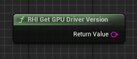

## 🇩🇪 Anleitung zur Verwendung des Plugins RHI API - Tools

Dieses Plugin enthält 9 verschiedene Nodes, die du im Screenshot unten sehen kannst:

   

<h1 align="center">RHI API Tools</h1>

   

Dieses Plugin wurde ausschließlich für Unreal Engine 5.4 entwickelt und getestet.

Die Nodes ermöglichen es Spielern, direkt im Spiel zwischen DirectX 11, 12 oder Vulkan zu wechseln. Das Plugin speichert den Startparameter in einer Textdatei und ermöglicht die Verwendung einer sekundären .exe-Datei (Launcher), die mit dem Suffix `*_Launcher.exe` benannt ist und dasselbe Symbol wie im Plugin-Fenster oder auf der Hauptseite dieses Repositories verwendet.

Wenn du das Symbol des Launchers ändern möchtest, kannst du dafür externe Tools nutzen.

---

### Einbindung in Ihr Projekt

Wenn Sie das Plugin gekauft haben und es Ihrem Projekt hinzufügen möchten:

Im Ordner `Resources` finden Sie folgende Dateien:

- `RHI_API_Tools_Launcher.exe`
- `launch_parameter.txt`

> Bitte beachten:  
>  
> - Die Datei `launch_parameter.txt` ist möglicherweise standardmäßig **nicht vorhanden** – das ist **vollkommen normal**. Sie speichert den Startparameter im Format `-dx11`, `-dx12`, `-vulkan`.  
> - **Der Dateiname `launch_parameter.txt` muss exakt so lauten**, inklusive der Endung `.txt`. Andernfalls kann das Plugin die Datei nicht verwenden – in diesem Fall wird beim nächsten Start automatisch eine neue Datei mit dem korrekten Namen erstellt.  
> - Die Datei `RHI_API_Tools_Launcher.exe` kann **beliebig benannt** werden, es wird jedoch **empfohlen**, den Namenszusatz `_Launcher.exe` beizubehalten – so erkennen Nutzer leichter, dass es sich um den Launcher handelt und nicht um die Hauptanwendung.

Sie können den gewünschten Startparameter im Voraus festlegen, indem Sie die Datei `launch_parameter.txt` manuell erstellen oder sie aus dem Ordner `Resources` kopieren.

Wenn Sie das Spiel im **Shipping-Modus** gepackt haben, platzieren Sie beide Dateien im selben Verzeichnis wie die Haupt-`.exe` der Anwendung – nur so kann das Plugin korrekt funktionieren.

   

---

### Plugin-Nodes

Alle Nodes befinden sich in der Kategorie **RHI API Tools**:

   

---

### API

1. **RHI API Change** – Damit kannst du die gewünschte RHI-API direkt im Editor oder im Shipping-Build auswählen.

   

2. **Get Current API** – Gibt die aktuell verwendete RHI API zurück (DX11, DX12, VULKAN)

   

3. **Get Supported RHI API** – Gibt ein String-Array mit den unterstützten RHI-APIs zurück (DX11, DX12, VULKAN)

   

---

### VRAM

4. **Get Available VRAM** – Zeigt an, wie viel Videospeicher verfügbar ist (Float)

   

5. **Get Reserved VRAM by Game** – Gibt den vom Spiel belegten Videospeicher zurück (Float)

   

6. **Get Total VRAM** – Zeigt den gesamten von deiner GPU unterstützten Videospeicher an (Float)

   

---

### GPU-Informationen

7. **RHI Get Current GPU Name** – Gibt den vollständigen Namen und Hersteller deiner GPU zurück (String)

   

8. **RHI Get GPU Driver Version** – Gibt die Treiberversion deiner GPU zurück (String, kann in eine Zahl konvertiert werden)

   

9. **RHI Get GPU Vendor** – Gibt den Namen des GPU-Herstellers zurück (String)

---

### Plugin-Struktur

   

1. Im Plugin befindet sich der Ordner `Content`, der zwei Dateien enthält:

   - Eine Karte mit Debug-Interface
   - Ein Widget mit der Benutzeroberfläche

   

Diese Dateien sind direkt im Unreal Engine 5.4 Editor über das Plugin sichtbar. Du kannst sie auch in dein Projekt kopieren, wenn du möchtest.

2. Die Benutzeroberfläche ist einfach gehalten und zeigt jede Funktion des Plugins visuell:

   

3. Im Widget gibt es neben dem Hauptlogik-Graph auch einen Event Graph, in dem alle Nodes des Plugins platziert sind:

   

---

Wenn du Fragen oder Probleme hast, tritt unserem Discord-Server bei: https://discord.gg/Yb9h4XGbWN
