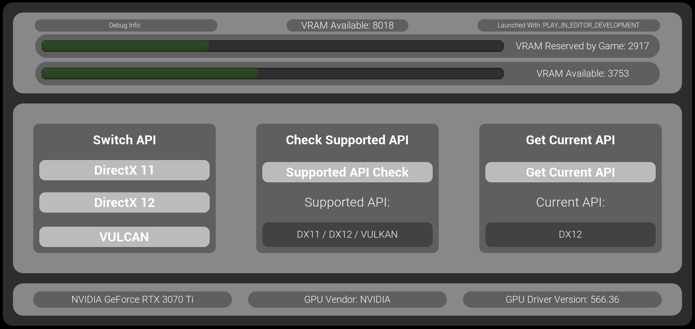

## 🇬🇧 RHI API - Tools Plugin User Guide

This plugin includes 9 different nodes, which you can see in the screenshot below:

   

<h1 align="center">RHI API Tools</h1>

   

The plugin is developed and tested exclusively for Unreal Engine 5.4.

These nodes allow players to switch between DirectX 11, DirectX 12, and Vulkan directly from the game. The plugin saves the selected launch parameter in a text config file and can use a secondary executable file (`*_Launcher.exe`), which acts as a launcher — it uses the same icon as shown in the plugin section or on the main page of this repository.

If you want to change the launcher icon, you can use third-party tools.

---

### Integrating into Your Project

If you purchased the plugin and want to add it to your project:

- **Download `RHI_API_Tools_Launcher.exe`** from the link below:

**[RHI_API_Tools_Launcher.exe](https://github.com/GH-GAMES/RHI_API_Tools/blob/main/Launcher/RHI_API_Tools_Launcher.exe)**

- In the `Resources` folder, you will find a preset for the launch parameter file:

  - `launch_parameter.txt`

> Please note:  
>  
> - The `launch_parameter.txt` file may be missing by default — this is **normal**. It stores the launch parameter in the format `-dx11`, `-dx12`, `-vulkan`.  
> - **The file name must be exactly `launch_parameter.txt`** with the `.txt` extension. If the name or extension is different, the plugin will not recognize it — in this case, a new file with the correct name will be created on next launch.  
> - The `RHI_API_Tools_Launcher.exe` file can have **any name**, but it is **recommended** to keep the `_Launcher.exe` suffix to help users distinguish it from the main executable.

You can set the desired parameter in advance by creating the `launch_parameter.txt` manually or copying it from the `Resources` folder.

If you packaged your game in **Shipping** mode, place both files next to the main `.exe` in the root folder of your game — only then will the plugin function correctly.

   

---

### Plugin Nodes

All nodes are located under the **RHI API Tools** category.

   

---

### API

1. **RHI API Change** — allows you to select the desired RHI API directly from the editor or in the packaged game.

The "Selected API" string returns a result in the format `"DX11"`, `"DX12"` or `"VULKAN"`.

The boolean `"Force Use Launcher"` forces the plugin to use the config file regardless of the game's packaging type: Debug, Developing, or Publish.

Important: To apply the selected API to your game/project, you need to restart it, as the required API is initialized during launch, not in Runtime mode. In Runtime mode, you can only change the parameter to the desired one, but it will only take effect after a full restart.

P.S. Inside the UE5 editor itself, you will always see only the API specified in the project settings, because the game/project preview launches with this parameter, as it is initialized even before the actual launch.

   

2. **Get Current API** — returns the current API (`DX11`, `DX12`, `VULKAN`).

   

3. **Get Supported RHI API** — returns an array of supported APIs (`DX11`, `DX12`, `VULKAN`).

   

---

### VRAM

4. **Get Available VRAM** — returns the amount of available video memory (`Float`).

   

5. **Get Reserved VRAM by Game** — returns the amount of video memory used by the game (`Float`).

   

6. **Get Total VRAM** — returns the total supported video memory (`Float`).

   

---

### Application Launch Mode

7. **RHI Get Current Launch Mode** — retrieves information on how the game/project was launched, as well as the build mode.

Possible launch modes:

- `"SIMULATION"`
- `"PLAY_IN_EDITOR"`
- `"EDITOR"`
- `"DEDICATED_SERVER"`
- `"STANDALONE"`
- `"UNKNOWN"`

Possible build modes:

- `"SHIPPING"`
- `"DEVELOPMENT"`
- `"DEBUG"`
- `"UNKNOWNBUILD"`

The node returns a combined string in the format:

`PLAY_IN_EDITOR_DEVELOPMENT`, `STANDALONE_SHIPPING`, etc.

   

---

### GPU Information

8. **RHI Get Current GPU Name** — returns a string with the full GPU name and vendor (`String`).

   

9. **RHI Get GPU Driver Version** — returns a string with the GPU driver version (can be converted to a number if needed).

   

10. **RHI Get GPU Vendor** — returns the GPU vendor name (`String`).

   

---

### Plugin Structure

   

1. Inside the plugin, there is a `Content` folder containing:

   - A sample map with a debug interface
   - A widget demonstrating all plugin features

   

These files are accessible directly in the UE 5.4 editor via the plugin folder. You can also copy them into your project if needed.

2. The plugin interface is intuitive and showcases all functionalities:

   

3. All plugin nodes are placed in the widget's Event Graph:

   

---

If you have any questions or issues — join our Discord: https://discord.gg/Yb9h4XGbWN
