## 🇫🇷 Guide d'utilisation du plugin RHI API - Tools

Ce plugin contient 9 nœuds différents que vous pouvez voir dans la capture d'écran ci-dessous :

  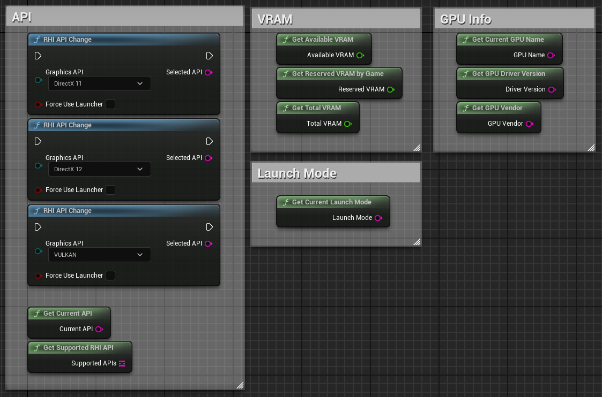 

<h1 align="center">RHI API Tools</h1>

  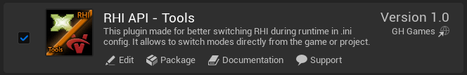 

Le plugin a été développé et testé exclusivement pour Unreal Engine 5.4.

Ces nœuds permettent aux joueurs de basculer entre DirectX 11, DirectX 12 et Vulkan directement depuis le jeu. Le plugin enregistre le paramètre de lancement sélectionné dans un fichier de configuration texte et peut utiliser un exécutable secondaire (`*_Launcher.exe`), qui agit comme un lanceur — avec la même icône que celle affichée dans la section plugin ou sur la page principale de ce dépôt.

Si vous souhaitez modifier l'icône du lanceur, vous pouvez utiliser des outils tiers.

---

### Intégration à votre projet

Si vous avez acheté le plugin et souhaitez l'ajouter à votre projet :

- **Téléchargez `RHI_API_Tools_Launcher.exe`** via le lien suivant :

**[RHI_API_Tools_Launcher.exe](https://github.com/GH-GAMES/RHI_API_Tools/blob/main/Launcher/RHI_API_Tools_Launcher.exe)**

- Dans le dossier `Resources`, vous trouverez un modèle du fichier de paramètre de lancement :

  - `launch_parameter.txt`

> Remarques importantes :  
>  
> - Le fichier `launch_parameter.txt` peut être absent par défaut — c'est **normal**. Il stocke le paramètre de lancement au format `-dx11`, `-dx12`, `-vulkan`.  
> - **Le nom du fichier doit être exactement `launch_parameter.txt`**, avec l'extension `.txt`. Si le nom ou l'extension est différent, le plugin ne pourra pas l'utiliser — un nouveau fichier avec le nom correct sera créé au prochain lancement.  
> - Le fichier `RHI_API_Tools_Launcher.exe` peut avoir **n'importe quel nom**, mais il est **recommandé** de conserver le suffixe `_Launcher.exe` afin de le distinguer facilement de l'exécutable principal.

Vous pouvez définir le paramètre nécessaire à l'avance en créant manuellement le fichier `launch_parameter.txt` ou en le copiant depuis le dossier `Resources`.

Si vous avez emballé votre jeu en mode **Shipping**, placez ces deux fichiers à côté de l'exécutable principal `.exe` à la racine du jeu — le plugin fonctionnera correctement uniquement dans ces conditions.

  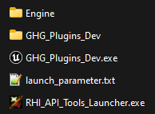 

---

### Nœuds du plugin

Tous les nœuds se trouvent dans la catégorie **RHI API Tools**.

  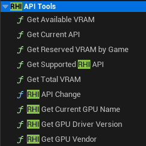 

---

### API

1. **RHI API Change** — permet de sélectionner l'API RHI souhaitée directement depuis l'éditeur ou dans le jeu emballé.

La chaîne "Selected API" retourne un résultat au format `"DX11"`, `"DX12"` ou `"VULKAN"`.

La variable booléenne `"Force Use Launcher"` force l'utilisation du fichier de configuration, quel que soit le type de packaging du jeu : Debug, Developing ou Publish.

Important : Pour appliquer l'API sélectionnée à votre jeu/projet, vous devez le redémarrer, car l'API dont nous avons besoin s'initialise précisément au moment du lancement, et non en mode Runtime. En mode Runtime, il est seulement possible de modifier le paramètre vers celui que nous souhaitons, mais il ne sera appliqué qu'après un redémarrage complet.

P.S. Dans l'éditeur UE5 lui-même, vous ne verrez toujours que l'API spécifiée dans les paramètres du projet, car l'aperçu du jeu/projet se lance avec ce paramètre, celui-ci étant initialisé avant même le démarrage effectif.

  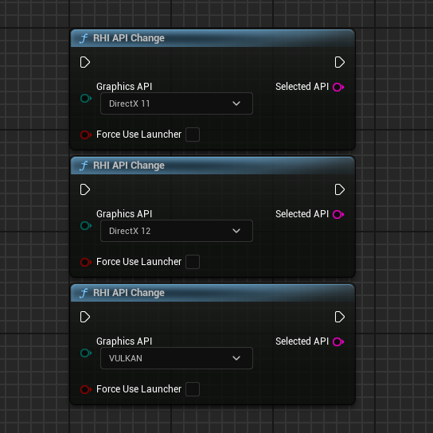 

2. **Get Current API** — retourne l'API actuellement utilisée (`DX11`, `DX12`, `VULKAN`).

  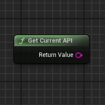 

3. **Get Supported RHI API** — retourne un tableau des APIs prises en charge (`DX11`, `DX12`, `VULKAN`).

  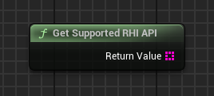 

---

### VRAM

4. **Get Available VRAM** — retourne la quantité de mémoire vidéo disponible (`Float`).

  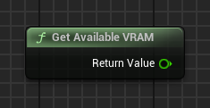 

5. **Get Reserved VRAM by Game** — retourne la mémoire vidéo utilisée par le jeu (`Float`).

   

6. **Get Total VRAM** — retourne la quantité totale de VRAM prise en charge (`Float`).

   

---

### Mode de lancement de l'application

7. **RHI Get Current Launch Mode** — permet d'obtenir des informations sur la façon dont le jeu/projet a été lancé ainsi que le mode de build.

Modes de lancement possibles :

- `"SIMULATION"`
- `"PLAY_IN_EDITOR"`
- `"EDITOR"`
- `"DEDICATED_SERVER"`
- `"STANDALONE"`
- `"UNKNOWN"`

Modes de build possibles :

- `"SHIPPING"`
- `"DEVELOPMENT"`
- `"DEBUG"`
- `"UNKNOWNBUILD"`

Le résultat est une chaîne combinée au format :

`PLAY_IN_EDITOR_DEVELOPMENT`, `STANDALONE_SHIPPING`, etc.

  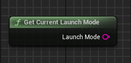 

---

### Informations sur la carte graphique

8. **RHI Get Current GPU Name** — retourne le nom complet de la carte graphique et de son fabricant (`String`).

  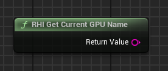 

9. **RHI Get GPU Driver Version** — retourne la version du pilote GPU (peut être convertie en nombre si nécessaire).

   

10. **RHI Get GPU Vendor** — retourne le nom du fabricant de la carte graphique (`String`).

  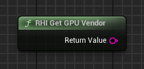 

---

### Structure du plugin

  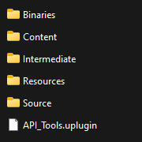 

1. Le dossier `Content` du plugin contient :

   - Une carte d'exemple avec une interface de débogage
   - Un widget démontrant toutes les fonctionnalités du plugin

  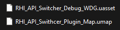 

Ces fichiers sont accessibles directement depuis l'éditeur UE 5.4 via le dossier du plugin. Vous pouvez également les copier dans votre projet si nécessaire.

2. L'interface du plugin est intuitive et montre toutes les fonctionnalités :

  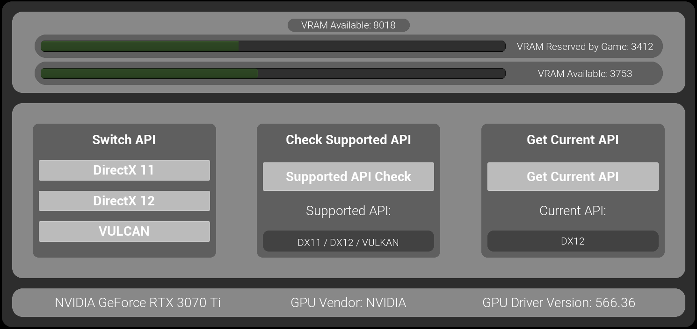 

3. Tous les nœuds du plugin sont placés dans le Event Graph du widget :

  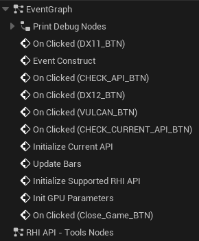 

---

Si vous avez des questions ou des problèmes — rejoignez notre Discord : https://discord.gg/Yb9h4XGbWN
