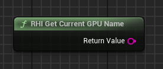

## 🇯🇵 RHI API - Tools プラグイン使用ガイド（日本語）

このプラグインには、以下のスクリーンショットに示されている 9 種類のノードが含まれています：

   

<h1 align="center">RHI API Tools</h1>

   

このプラグインは **Unreal Engine 5.4** 専用に設計およびテストされています。

ノードを使用することで、プレイヤーはゲーム内で DirectX 11、12 または Vulkan を直接切り替えることができます。プラグインは起動パラメータをテキストファイルに保存し、「*_Launcher.exe」という名前のセカンダリ実行ファイル（ランチャー）を使用することもできます。このランチャーは、プラグインメニューやリポジトリのメインページに表示されているアイコンと同じものを使用しています。

もしランチャー .exe のアイコンを変更したい場合は、外部ツールを使用することをおすすめします。

---

### プラグインを購入してプロジェクトに導入するには：

`Resources` フォルダ内には以下のファイルが含まれています：

- `RHI_API_Tools_Launcher.exe`
- `launch_parameter.txt`

> ⚠️ `launch_parameter.txt` は初期状態では存在しない場合がありますが、それは正常です。このファイルには `-dx11`, `-dx12`, `-vulkan` などの起動パラメータが保存されます。

起動時に特定の API を選択したい場合は、このファイルをコピーして使用するか、新しく作成して希望のパラメータを書き込んでください。

ゲームが Shipping モードでパッケージ化されている場合は、これらのファイルをゲームのルートディレクトリ（.exe と同じ階層）に配置する必要があります。正しく配置されないと、プラグインは機能しません。

---

### ノード一覧

すべてのノードは **RHI API Tools** カテゴリに含まれています：

   

---

### API ノード

1. **RHI API Change** — エディタまたは Shipping ビルド内で API を選択できます。

   

2. **Get Current API** — 現在使用中の RHI API（DX11、DX12、VULKAN）を取得します。

   

3. **Get Supported RHI API** — 使用可能な RHI API を配列として返します。

   

---

### VRAM 情報

4. **Get Available VRAM** — GPU の使用可能なメモリ量を取得します（Float）

   

5. **Get Reserved VRAM by Game** — ゲームによって使用されている VRAM を取得します（Float）

   

6. **Get Total VRAM** — GPU の総メモリ容量を取得します（Float）

   

---

### GPU 情報

7. **RHI Get Current GPU Name** — 使用中の GPU のモデル名とベンダー名を取得します（String）

   

8. **RHI Get GPU Driver Version** — GPU ドライバのバージョンを取得します（String）

   

9. **RHI Get GPU Vendor** — GPU のベンダー名を取得します（String）

---

### プラグイン構造について

   

1. プラグインの `Content` フォルダには以下の 2 つのファイルがあります：

   - デバッグ UI を起動するためのレベルマップ
   - インターフェースを視覚化したウィジェット

   

これらのファイルは Unreal Editor のプラグインフォルダから直接アクセスできます。必要に応じてプロジェクトへコピーまたは移動可能です。

2. UI は非常にシンプルで、すべての機能が明確に表示されます：

   

3. ウィジェット内には、全ノードの Blueprint 使用例が組み込まれています：

   

---

### ❓ サポートが必要ですか？

ご不明点があれば、Discord コミュニティへお気軽にご参加ください：  
👉 https://discord.gg/Yb9h4XGbWN
