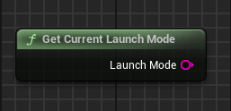

## 🇯🇵 RHI API - Tools プラグイン使用ガイド

このプラグインには、以下のスクリーンショットに示す 9 つのノードが含まれています。

   

<h1 align="center">RHI API Tools</h1>

   

このプラグインは Unreal Engine 5.4 専用に開発およびテストされています。

これらのノードを使用すると、プレイヤーはゲーム内から直接、DirectX 11、DirectX 12、Vulkan を切り替えることができます。プラグインは選択した起動パラメータをテキスト構成ファイルに保存し、ランチャーとして機能する二次実行ファイル（`*_Launcher.exe`）を使用できます。このランチャーは、プラグインセクションやリポジトリのメインページに表示されているものと同じアイコンを持ちます。

ランチャーのアイコンを変更したい場合は、サードパーティ製ツールをご利用ください。

---

### プロジェクトへの導入

プラグインを購入し、プロジェクトに追加したい場合：

`Resources` フォルダに次のファイルが含まれています。

- `RHI_API_Tools_Launcher.exe`
- `launch_parameter.txt`

> 注意:  
>  
> - `launch_parameter.txt` ファイルはデフォルトで存在しない場合がありますが、これは**正常**です。このファイルには `-dx11`、`-dx12`、`-vulkan` の形式で起動パラメータが保存されます。  
> - **ファイル名は必ず `launch_parameter.txt` にしてください**。名前や拡張子が異なると、プラグインは認識できません。この場合、次回起動時に正しい名前で新しいファイルが作成されます。  
> - `RHI_API_Tools_Launcher.exe` は**任意の名前**に変更できますが、`_Launcher.exe` という接尾辞を残すことを推奨します。これにより、ユーザーがメイン実行ファイルと区別しやすくなります。

必要なパラメータを事前に設定するには、`launch_parameter.txt` を手動で作成するか、`Resources` からコピーしてください。

ゲームを**Shipping** モードでパッケージ化した場合は、これら 2 つのファイルをゲームのルートフォルダにあるメイン `.exe` の隣に配置してください。これでプラグインが正しく動作します。

   

---

### プラグインノード

すべてのノードは **RHI API Tools** カテゴリ内にあります。

   

---

### API

1. **RHI API Change** — エディタまたはパッケージ化されたゲーム内で希望する RHI API を選択できます。

"Selected API" 文字列は `"DX11"`、`"DX12"`、`"VULKAN"` を返します。

ブール値 `"Force Use Launcher"` は、ゲームのビルドタイプ（Debug、Developing、Publish）に関係なく、設定ファイルの使用を強制します。

   

2. **Get Current API** — 現在使用中の API を返します（`DX11`、`DX12`、`VULKAN`）。

   

3. **Get Supported RHI API** — サポートされている API の配列を返します（`DX11`、`DX12`、`VULKAN`）。

   

---

### VRAM

4. **Get Available VRAM** — 使用可能なビデオメモリ容量を返します（`Float`）。

   

5. **Get Reserved VRAM by Game** — ゲームによって使用されているビデオメモリ容量を返します（`Float`）。

   

6. **Get Total VRAM** — サポートされている総ビデオメモリ容量を返します（`Float`）。

   

---

### アプリケーション起動モード

7. **RHI Get Current Launch Mode** — ゲーム/プロジェクトの起動方法とビルドモードに関する情報を提供します。

起動モードの例：

- `"SIMULATION"`
- `"PLAY_IN_EDITOR"`
- `"EDITOR"`
- `"DEDICATED_SERVER"`
- `"STANDALONE"`
- `"UNKNOWN"`

ビルドモードの例：

- `"SHIPPING"`
- `"DEVELOPMENT"`
- `"DEBUG"`
- `"UNKNOWNBUILD"`

結果は次のような形式の結合文字列になります：

`PLAY_IN_EDITOR_DEVELOPMENT`、`STANDALONE_SHIPPING` など。

   

---

### GPU情報

8. **RHI Get Current GPU Name** — GPU の正式名称とベンダー名を文字列で返します（`String`）。

   

9. **RHI Get GPU Driver Version** — GPU ドライバのバージョンを文字列で返します（必要に応じて数値に変換可能）。

   

10. **RHI Get GPU Vendor** — GPU のベンダー名を返します（`String`）。

   

---

### プラグイン構成

   

1. プラグイン内の `Content` フォルダには以下が含まれています：

   - デバッグインターフェース付きのサンプルマップ
   - プラグイン機能を示すウィジェット

   

これらのファイルは UE 5.4 エディタ内のプラグインフォルダから直接アクセス可能です。必要に応じてプロジェクトにコピーすることもできます。

2. プラグインのインターフェースは直感的で、すべての機能を視覚的に確認できます。

   

3. ウィジェットの Event Graph にはすべてのノードが配置されています。

   

---

ご不明な点や問題がございましたら、ぜひ Discord にご参加ください： https://discord.gg/Yb9h4XGbWN
