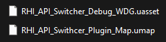

Инструкция по использованию плагина RHI API - Tools на Русском языке:

Данный плагин содержит в себе 9 различных нод, которые вы можете увидеть на скриншоте ниже:

   

<h1 align="center">RHI API Tools</h1>

   

Данный плагин разработан и проверен только для версии Unreal Engine 5.4

Данные ноды позволяют игрокам поменять DirectX 11, 12 или же в целом включить Vulkan напрямую из игры. Данный плагин позволяет сохранять параметр запуска в текстовом конфиге, а также использовать второстепенный .exe, который выполняет роль лаунчера - он имеет приписку "*_Launcher.exe" и иконку, точно такую же что вы можете увидеть в разделе плагинов или же на главной странице в данном репозитории.

Если же вы хотите поменять иконку у .exe, который является лаунчером, вы можете использовать сторонние программы для таких процедур.

Если вы купили плагин, и решили подключить его к вашему проекту:

В самом плагине в папке Resources вы сможете найти файлы, такие как:

RHI_API_Tools_Launcher.exe
launch_parameter.txt

Стоит заметить что файла launch_parameter.txt изначально может не быть, и это нормально, так как он лишь хранит в себе параметр запуска формата (-dx11, dx12, -vulkan)

Так что если вы хотите сразу задать параметр запуска, вы можете скопировать этот файл из Resources, или же создать его, и написать внутри нужный вам параметр запуска.

Если Ваша игра была упакована в формате Shipping, то вам нужно поместить эти файлы рядом с другим .exe файлом, в корне самой игры, только тогда этот плагин заработает как нужно.

Теперь про ноды:

Все ноды находятся в разделе RHI API Tools

   

API

1. RHI API Change нода позволяет выбрать необходимый нам API напрямую из редактора или же упакованной игры в режиме Shipping.

   

2. Get Current API - эта нода позволяет получить результат о нынешнем RHI API, и получает данные вида (DX11, DX12, VULKAN)

   

3. Get Supported RHI API - эта нода позволяет получить результат в виде String массива из данных о поддерживаемых API в формате (DX11, DX12, VULKAN)

   

VRAM

4. Get Available VRAM - эта нода позволяет узнать сколько видеопамяти у вашей видеокарты доступно (Float)

   

5. Get Reserved VRAM by Game - эта нода выводит значение о памяти, которая занимается игрой (Float)

   

6. Get Total VRAM - эта нода выводит общее значение памяти, которое поддерживается вашей видеокартой (Float)

   

GPU Info

7. RHI Get Current GPU Name - эта нода в формате String выводит полностью модель вашей видеокарты и ее вендор (String)

   

8. RHI Get GPU Driver Version - эта нода в формате String выводит версию драйвера вашей видеокарты, при желании можно это легко конвертировать в числовой формат (Sting)

   

9. RHI Get GPU Vendor - эта нода позволяет вывести в формате String имя Вендора вашей видеокарты (String)

Теперь немного про структуру плагина:

   

1. Внутри самого плагина есть папка Content, внутри которой хранится 2 файла:
	1. Карта, на которой можно запустить Debug интерфейс
	2. Виджет, в котором все сделано довольно наглядно
	

   

Эти файлы доступны через сам редактор Unreal Engine 5.4 напрямую из папки плагина, но если есть такое желание, вы можете скопировать или перенести эти файлы именно в ваш проект напрямую.

2. Сам выполнен не слишком сложно, и показывает наглядно каждую функцию данного плагина:

   

3. Внутри виджета есть не только основной код, работающий с самим интерфейсом и функциями плагина, но и еще один Event Graph, где выставлены все ноды из данного плагина:

   

Если у вас возникли какие-то сложности с плагином, вы можете присоединиться к нашему Discord каналу: https://discord.gg/Yb9h4XGbWN