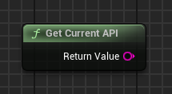

## 🇹🇷 RHI API - Tools Eklenti Kullanım Kılavuzu

Bu eklenti, aşağıdaki ekran görüntüsünde görebileceğiniz 9 farklı düğüm (node) içermektedir:

   

<h1 align="center">RHI API Tools</h1>

   

Eklenti, yalnızca Unreal Engine 5.4 için geliştirilmiş ve test edilmiştir.

Bu düğümler sayesinde oyuncular, oyun içerisinden DirectX 11, DirectX 12 ve Vulkan arasında geçiş yapabilir. Eklenti, seçilen başlatma parametresini bir metin konfigürasyon dosyasına kaydeder ve başlatıcı olarak çalışan ikincil bir yürütülebilir dosya (`*_Launcher.exe`) kullanabilir. Bu dosya, eklenti bölümünde veya bu deposunun ana sayfasında belirtilen aynı simgeyi kullanır.

Başlatıcı simgesini değiştirmek isterseniz, üçüncü parti araçlar kullanabilirsiniz.

---

### Projenize Eklentiyi Ekleme

Eklentiyi satın aldıysanız ve projenize eklemek istiyorsanız:

- **`RHI_API_Tools_Launcher.exe` dosyasını buradan indirebilirsiniz:**

**[RHI_API_Tools_Launcher.exe](https://github.com/GH-GAMES/RHI_API_Tools/blob/main/Launcher/RHI_API_Tools_Launcher.exe)**

- `Resources` klasöründe başlatma parametresi için bir şablon dosya bulunur:

  - `launch_parameter.txt`

> Dikkat:  
>  
> - `launch_parameter.txt` dosyası varsayılan olarak bulunmayabilir — bu **normaldir**. Parametreyi şu formatta saklar: `-dx11`, `-dx12`, `-vulkan`.  
> - **Dosya adı kesinlikle `launch_parameter.txt` olmalıdır**, uzantısı `.txt`. Farklı bir isim veya uzantı kullanılırsa eklenti dosyayı tanımaz ve bir sonraki başlatmada doğru isimle yeni bir dosya oluşturur.  
> - `RHI_API_Tools_Launcher.exe` dosyasının adı **istediğiniz gibi** olabilir, ancak `_Launcher.exe` son ekini korumanız **tavsiye edilir**. Böylece kullanıcılar başlatıcıyı ana yürütülebilir dosyadan kolayca ayırt edebilir.

Gerekli parametreyi önceden ayarlayabilir veya `Resources` klasöründen kopyalayabilirsiniz.

Oyununuzu **Shipping** modunda paketlediyseniz, bu iki dosyayı oyunun kök dizinindeki ana `.exe` dosyasının yanına yerleştirin — eklenti yalnızca bu şekilde doğru çalışacaktır.

   

---

### Eklenti Düğümleri

Tüm düğümler **RHI API Tools** kategorisinde bulunur.

   

---

### API

1. **RHI API Change** — İstediğiniz RHI API'yi editörden veya paketlenmiş oyundan seçmenizi sağlar.

"Selected API" string değeri `"DX11"`, `"DX12"` veya `"VULKAN"` olarak döner.

`"Force Use Launcher"` boolean değişkeni, oyun paketleme türü ne olursa olsun yapılandırma dosyasını kullanmaya zorlar: Debug, Developing veya Publish.

Önemli: Seçtiğiniz API'nin oyununuzda/projenizde uygulanabilmesi için yeniden başlatmanız gerekmektedir. Çünkü ihtiyacımız olan API yalnızca başlangıç sırasında başlatılır, Runtime modunda değil. Runtime modunda yalnızca parametreyi istediğimiz şekilde değiştirebiliriz, ancak bu değişiklik yalnızca tam bir yeniden başlatma sonrasında uygulanacaktır.

Not: UE5 editörü içinde yalnızca proje ayarlarında belirtilen API'yi göreceksiniz. Çünkü oyun/proje önizlemesi bu parametreyle başlatılır, zira API asıl başlangıçtan önce başlatılmış olur.

   

2. **Get Current API** — Mevcut API'yi döner (`DX11`, `DX12`, `VULKAN`).

   

3. **Get Supported RHI API** — Desteklenen API'lerin listesini döner (`DX11`, `DX12`, `VULKAN`).

   

---

### VRAM

4. **Get Available VRAM** — Kullanılabilir video belleğini döner (`Float`).

   

5. **Get Reserved VRAM by Game** — Oyun tarafından kullanılan video belleğini döner (`Float`).

   

6. **Get Total VRAM** — Toplam desteklenen video belleğini döner (`Float`).

   

---

### Uygulama Başlatma Modu

7. **RHI Get Current Launch Mode** — Oyun/projenin nasıl başlatıldığını ve yapı modunu belirtir.

Başlatma modları:

- `"SIMULATION"`
- `"PLAY_IN_EDITOR"`
- `"EDITOR"`
- `"DEDICATED_SERVER"`
- `"STANDALONE"`
- `"UNKNOWN"`

Yapı modları:

- `"SHIPPING"`
- `"DEVELOPMENT"`
- `"DEBUG"`
- `"UNKNOWNBUILD"`

Sonuç şu formatta döner:

`PLAY_IN_EDITOR_DEVELOPMENT`, `STANDALONE_SHIPPING` vb.

   

---

### GPU Bilgisi

8. **RHI Get Current GPU Name** — GPU'nun tam adını ve üreticisini döner (`String`).

   

9. **RHI Get GPU Driver Version** — GPU sürücü versiyonunu döner (gerekirse sayıya dönüştürülebilir).

   

10. **RHI Get GPU Vendor** — GPU üretici adını döner (`String`).

   

---

### Eklenti Yapısı

   

1. Eklenti içinde `Content` klasörü bulunur ve burada şunlar yer alır:

   - Örnek harita ve debug arayüzü
   - Tüm eklenti işlevlerini gösteren widget

   

Bu dosyalar UE 5.4 editörü üzerinden doğrudan erişilebilir. İsterseniz projeye kopyalayabilirsiniz.

2. Eklenti arayüzü sezgiseldir ve tüm işlevleri gösterir:

   

3. Widget'ın Event Graph bölümünde tüm düğümler bulunur:

   

---

Herhangi bir sorunuz veya probleminiz varsa, Discord topluluğumuza katılın: https://discord.gg/Yb9h4XGbWN
