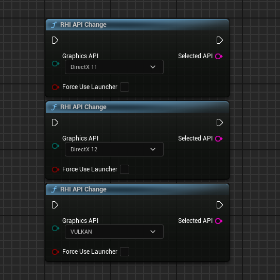
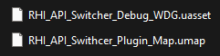

## 🇹🇷 RHI API - Tools Eklentisi Kullanım Kılavuzu (Türkçe)

Bu eklenti, aşağıdaki ekran görüntüsünde görebileceğiniz 9 farklı düğüm içerir:

   

<h1 align="center">RHI API Tools</h1>

   

Bu eklenti yalnızca **Unreal Engine 5.4** sürümü için geliştirilmiş ve test edilmiştir.

Bu düğümler oyuncuların oyunun içinden doğrudan DirectX 11, 12 veya Vulkan’ı değiştirmesine olanak tanır. Eklenti, başlatma parametresini bir metin dosyasında saklayabilir ve ayrıca “*_Launcher.exe” uzantısına sahip, aynı simgeyi kullanan ikincil bir .exe dosyasını başlatıcı olarak kullanabilir.

Başlatıcı olarak kullanılacak .exe dosyasının simgesini değiştirmek isterseniz, bu işlem için üçüncü taraf yazılımlar kullanabilirsiniz.

---

### Eklentiyi Satın Aldıysanız ve Projenize Dahil Etmek İstiyorsanız:

`Resources` klasörünün içinde şu dosyaları bulacaksınız:

- `RHI_API_Tools_Launcher.exe`
- `launch_parameter.txt`

> ⚠️ `launch_parameter.txt` dosyası varsayılan olarak mevcut olmayabilir — bu normaldir. Bu dosya yalnızca `-dx11`, `-dx12`, `-vulkan` gibi başlatma parametresini içerir.

Başlatma parametresini önceden ayarlamak istiyorsanız, bu dosyayı Resources klasöründen kopyalayabilir veya manuel olarak oluşturup içine istediğiniz parametreyi yazabilirsiniz.

Oyununuz Shipping formatında paketlendiyse, bu dosyaları oyun kök klasörüne (ana .exe dosyasının yanına) yerleştirmeniz gerekir.

---

### Düğüm Listesi

Tüm düğümler **RHI API Tools** kategorisinde bulunur:

   

---

### API Düğümleri

1. **RHI API Change** — Editörden veya Shipping sürümünden istenilen API'yi seçmenize olanak tanır.

   

2. **Get Current API** — Mevcut kullanılan RHI API değerini verir (DX11, DX12, VULKAN).

   

3. **Get Supported RHI API** — Desteklenen RHI API’leri bir dizi (String Array) olarak döndürür (DX11, DX12, VULKAN).

   

---

### VRAM Bilgisi

4. **Get Available VRAM** — Mevcut kullanılabilir GPU belleğini verir (Float)

   

5. **Get Reserved VRAM by Game** — Oyun tarafından kullanılan GPU belleğini döndürür (Float)

   

6. **Get Total VRAM** — Toplam GPU belleğini döndürür (Float)

   

---

### GPU Bilgisi

7. **RHI Get Current GPU Name** — GPU model adını ve üreticisini bir string olarak verir

   

8. **RHI Get GPU Driver Version** — GPU sürücü sürümünü verir

   

9. **RHI Get GPU Vendor** — GPU üretici adını bir string olarak verir

   

---

### Eklenti Yapısı

   

1. `Content` klasörü içerisinde şu iki içerik bulunur:

   - Debug arayüzünü başlatmak için bir harita
   - Tüm düğüm işlevlerinin örneklerini içeren bir widget

   

Bu dosyalar doğrudan Unreal Engine 5.4 editöründe açılabilir. İsterseniz proje dosyanıza manuel olarak da kopyalayabilirsiniz.

2. Arayüz oldukça basittir ve tüm işlevleri açık şekilde gösterir:

   

3. Widget içinde hem arayüzün temel işleyişi hem de tüm düğümleri örnekleyen ayrı bir Event Graph bulunmaktadır:

   

---

### ❓ Yardım mı gerekiyor?

Herhangi bir sorunla karşılaşırsanız veya desteğe ihtiyacınız olursa Discord sunucumuza katılabilirsiniz:  
👉 https://discord.gg/Yb9h4XGbWN
