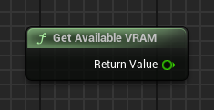

## 🇨🇳 RHI API - Tools 插件使用说明（中文）

该插件包含 9 个不同的节点，您可以在下图中查看：

   

<h1 align="center">RHI API Tools</h1>

   

本插件专为 Unreal Engine 5.4 版本开发和测试。

这些节点允许玩家在游戏中直接切换 DirectX 11、DirectX 12 或 Vulkan。该插件能够将启动参数保存到文本配置中，并支持使用次要的 .exe 启动器文件，命名格式为 "*_Launcher.exe"，并拥有与插件列表或本仓库首页相同的图标。

如果您想修改该启动器 .exe 的图标，可以使用第三方工具实现。

---

### 集成到您的项目中

如果您已购买插件并希望将其添加到您的项目中：

在 `Resources` 文件夹中，您将找到以下文件：

- `RHI_API_Tools_Launcher.exe`
- `launch_parameter.txt`

> 请注意：  
>  
> - `launch_parameter.txt` 文件**默认可能不存在** — 这是**完全正常**的。该文件以 `-dx11`、`-dx12` 或 `-vulkan` 的格式存储启动参数。  
> - **该文件的名称必须严格为 `launch_parameter.txt`**，并且必须包含 `.txt` 扩展名。如果文件名或扩展名不正确，插件将无法识别该文件 — 此时将在下次启动时自动生成一个名称正确的新文件。  
> - `RHI_API_Tools_Launcher.exe` 文件**可以使用任何名称**，但**建议保留 `_Launcher.exe` 后缀**，这样用户更容易辨认它是启动器而不是主程序。

您可以手动创建 `launch_parameter.txt` 文件，或从 `Resources` 文件夹中复制，以预设所需的启动参数。

如果您以 **Shipping 模式** 打包了游戏，请将这两个文件与主 `.exe` 文件一起放在游戏根目录中 — 只有这样插件才能正常工作。

   

---

### 插件节点

所有节点位于 **RHI API Tools** 分类中：

   

---

### API 节点

1. **RHI API Change** — 允许在编辑器或 Shipping 模式下的打包游戏中选择所需的图形 API。

   

2. **Get Current API** — 获取当前使用的 RHI 图形 API（返回 DX11、DX12、VULKAN）

   

3. **Get Supported RHI API** — 获取所有受支持的 RHI 图形 API（返回字符串数组）

   

---

### 显存信息

4. **Get Available VRAM** — 获取当前 GPU 可用显存（Float）

   

5. **Get Reserved VRAM by Game** — 获取游戏占用的显存（Float）

   

6. **Get Total VRAM** — 获取 GPU 的总显存容量（Float）

   

---

### GPU 信息

7. **RHI Get Current GPU Name** — 获取当前 GPU 的完整型号和厂商（String）

   

8. **RHI Get GPU Driver Version** — 获取 GPU 驱动版本（String），可轻松转换为数值类型

   

9. **RHI Get GPU Vendor** — 获取 GPU 厂商名称（String）

---

### 插件结构介绍

   

1. 插件自带一个 `Content` 文件夹，包含两个主要资源：

   - 一个用于测试的地图，其中可以运行 Debug 界面
   - 一个用于交互的可视化小部件

   

这些资源可以直接通过 Unreal Engine 5.4 的插件浏览器访问。您也可以根据需求将其复制或迁移到自己的项目中。

2. UI 界面非常直观，展示了所有插件功能：

   

3. 小部件内部除了主要逻辑外，还有一个 Event Graph，展示了所有节点的示例：

   

---

如有任何问题，欢迎加入我们的 Discord 社区：  
👉 https://discord.gg/Yb9h4XGbWN
