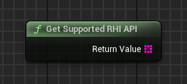
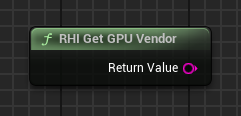

## 🇨🇳 RHI API - Tools 插件使用指南

该插件包含 9 个不同的节点，您可以在下方截图中查看：

   

<h1 align="center">RHI API Tools</h1>

   

本插件专为 Unreal Engine 5.4 开发并经过测试。

这些节点允许玩家在游戏中直接切换 DirectX 11、DirectX 12 和 Vulkan。插件会将所选的启动参数保存在文本配置文件中，并可使用二级可执行文件（`*_Launcher.exe`）作为启动器——该启动器图标与插件页面或此仓库主页上的图标相同。

如果您想更改启动器图标，可以使用第三方工具。

---

### 集成到您的项目

如果您购买了插件并希望将其添加到项目中：

- **您可以通过以下链接下载 `RHI_API_Tools_Launcher.exe`：**

**[RHI_API_Tools_Launcher.exe](https://github.com/GH-GAMES/RHI_API_Tools/blob/main/Launcher/RHI_API_Tools_Launcher.exe)**

- 在 `Resources` 文件夹中，包含启动参数的预设文件：

  - `launch_parameter.txt`

> 注意事项：  
>  
> - `launch_parameter.txt` 文件默认可能不存在——这是**正常现象**。该文件以 `-dx11`、`-dx12`、`-vulkan` 格式保存启动参数。  
> - **文件名必须严格为 `launch_parameter.txt`**，扩展名为 `.txt`。如果名称或扩展名不同，插件将无法识别，下一次启动时会自动创建正确的文件。  
> - `RHI_API_Tools_Launcher.exe` 文件名称**可以自定义**，但**建议**保留 `_Launcher.exe` 结尾，方便用户区分启动器与主程序。

您可以手动创建或从 `Resources` 文件夹复制该参数文件。

如果您将游戏打包为 **Shipping** 模式，请将这两个文件放置在游戏根目录下主 `.exe` 文件旁边——只有这样插件才能正常工作。

   

---

### 插件节点

所有节点均位于 **RHI API Tools** 分类下。

   

---

### API 功能

1. **RHI API Change** — 允许在编辑器或打包后的游戏中选择所需的 RHI API。

字符串 "Selected API" 返回 `"DX11"`、`"DX12"` 或 `"VULKAN"`。

布尔变量 `"Force Use Launcher"` 强制插件使用配置文件，无论游戏打包类型（Debug、Developing 或 Publish）。

重要提示： 要将选定的API应用到您的游戏/项目中，必须重新启动。因为所需的API仅在启动时初始化，而非在Runtime模式下。在Runtime模式下只能修改参数设置，但需完全重启后才会生效。

附注： 在UE5编辑器内，您将始终只能看到项目中设置的API，因为游戏/项目预览会以该参数启动——它早在实际运行前就已初始化完成。

   

2. **Get Current API** — 返回当前使用的 API（`DX11`、`DX12`、`VULKAN`）。

   

3. **Get Supported RHI API** — 返回支持的 API 列表（`DX11`、`DX12`、`VULKAN`）。

   

---

### 显存 (VRAM)

4. **Get Available VRAM** — 返回可用显存大小（`Float`）。

   

5. **Get Reserved VRAM by Game** — 返回游戏占用的显存大小（`Float`）。

   

6. **Get Total VRAM** — 返回显卡支持的总显存（`Float`）。

   

---

### 应用启动模式

7. **RHI Get Current Launch Mode** — 获取游戏/项目的启动方式及构建模式。

启动模式可能为：

- `"SIMULATION"`
- `"PLAY_IN_EDITOR"`
- `"EDITOR"`
- `"DEDICATED_SERVER"`
- `"STANDALONE"`
- `"UNKNOWN"`

构建模式可能为：

- `"SHIPPING"`
- `"DEVELOPMENT"`
- `"DEBUG"`
- `"UNKNOWNBUILD"`

返回结果为组合字符串，例如：

`PLAY_IN_EDITOR_DEVELOPMENT`、`STANDALONE_SHIPPING` 等。

   

---

### 显卡信息

8. **RHI Get Current GPU Name** — 返回显卡的完整名称及厂商（`String`）。

   

9. **RHI Get GPU Driver Version** — 返回显卡驱动版本（如有需要，可转换为数字）。

   

10. **RHI Get GPU Vendor** — 返回显卡厂商名称（`String`）。

   

---

### 插件结构

   

1. 插件内的 `Content` 文件夹包含：

   - 示例地图及调试界面
   - 展示所有功能的控件（Widget）

   

这些文件可在 UE 5.4 编辑器中直接访问。如有需要，您也可以将其复制到项目中。

2. 插件界面直观，展示所有功能：

   

3. 所有节点均在控件的 Event Graph 中展示：

   

---

如有任何问题或疑问，请加入我们的 Discord 社区： https://discord.gg/Yb9h4XGbWN
