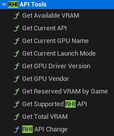

Данный плагин содержит в себе 9 различных нод, которые вы можете увидеть на скриншоте ниже:

   

<h1 align="center">RHI API Tools</h1>

Данный плагин разработан и проверен только для версии Unreal Engine 5.4

Данные ноды позволяют игрокам поменять DirectX 11, 12 или же в целом включить Vulkan напрямую из игры. Данный плагин позволяет сохранять параметр запуска в текстовом конфиге, а также использовать второстепенный .exe, который выполняет роль лаунчера - он имеет приписку "*_Launcher.exe" и иконку, точно такую же что вы можете увидеть в разделе плагинов или же на главной странице в данном репозитории.

Если же вы хотите поменять иконку у .exe, который является лаунчером, вы можете использовать сторонние программы для таких процедур.

Если вы купили плагин, и решили подключить его к вашему проекту:

В самом плагине в папке Binaries вы сможете найти файлы, такие как:

RHI_API_Tools_Launcher.exe
launch_parameter.txt

Стоит заметить что файла launch_parameter.txt изначально может не быть, и это нормально, так как он лишь хранит в себе параметр запуска формата (-dx11, dx12, -vulkan)

Так что если вы хотите сразу задать параметр запуска, вы можете скопировать этот файл из Binaries, или же создать его, и написать внутри нужный вам параметр запуска.

Теперь про ноды:

Все ноды находятся в разделе RHI API Tools

   

1. RHI API Change нода позволяет выбрать необходимый нам API напрямую из редактора или же упакованной игры в режиме Shipping.

   

2. Get Current API - эта нода позволяет получить результат о нынешнем RHI API, и получает данные вида (DX11, DX12, VULKAN)

   

